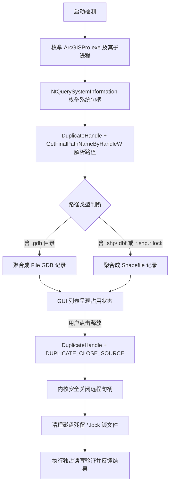

# ArcGIS Pro 地理数据独占锁解除工具 (ArcGIS Data Lock Releaser)

<p align="center">
  
  
  
  
  <a href="https://github.com/brildo/arcgis-data-lock-releaser/releases/latest">
    
  </a>
  
</p>

---

## 📖 项目背景与解决的痛点

在日常 GIS 生产与数据处理工作中，**ArcGIS Pro** 对地理数据库（File Geodatabase，`.gdb`）和 Shapefile（`.shp`）通常采用**独占锁（Exclusive Lock）**或强句柄缓存机制：

- **常见痛点场景**：
  1. 用户在 ArcGIS Pro 中查看或编辑完数据后，已经在【内容】列表中**移除了图层**，甚至**关闭了地图或工程视图**；
  2. 但底层核心进程（`ArcGISPro.exe`）依然长期持有这些文件的 **Windows 底层操作系统文件句柄** 与 **`.lock` 锁文件**；
  3. 当第三方软件（如 QGIS、FME、PostgreSQL/PostGIS 导入工具、Python `geopandas` / `arcpy` 外部脚本）尝试以读写模式覆盖、重命名或更新该数据集时，必然遭遇 `PermissionError` 或 `Sharing Violation` 独占冲突；
  4. 此前的唯一解决办法是**彻底退出并关闭庞大的 ArcGIS Pro 进程**，严重打断多任务协同流。

**本工具专为解决该痛点而设计**：无需重启或关闭 ArcGIS Pro，即可精准探测哪些 GDB 或 Shapefile 正处于被锁状态，并在保证 Pro 进程平稳运行的前提下一键跨进程安全释放独占锁，使外部软件立即可读可写！

---

## ✨ 核心特性

- **非侵入式释放**：绝不暴力结束（Kill）ArcGIS Pro 主进程，仅针对目标数据集相关的底层文件句柄执行安全闭合，不影响 Pro 内正在进行的其他工程与工作流。
- **双主流地理格式支持**：
  - **File Geodatabase (`.gdb`)**：识别整个 GDB 文件夹结构与各子表文件句柄；
  - **Shapefile (`.shp`)**：智能反向聚合 `.shp`、`.dbf`、`.shx` 实体句柄及同级目录下的伴生锁文件（如 `*.shp.*.lock`）。
- **双重彻底解除**：
  1. 操作系统级：安全关闭 Windows 内核层面的打开文件句柄；
  2. 文件系统级：自动同步清理残留在目录下的孤立 `.lock` 文件。
- **即时读写独占性验证**：释放完成后内置独占性写测试，即时反馈外部是否已拥有完全写入权限。
- **现代化极简 GUI**：
  - 基于 Python 原生 Tkinter 开发，卡片式界面，清晰直观；
  - 支持自动巡检（每 5 秒自动检测最新占用状态）；
  - 支持单选释放、批量勾选释放与一键释放全部；
  - 支持一键在 Windows 资源管理器中定位目标文件。
- **绿色免依赖**：纯 Python + Windows Native API (ctypes) 打造，无需配置复杂的编译环境，双击即用。

---

## 🔬 技术实现原理

ArcGIS Pro 的数据占用由**两层机制**构成：
1. **`.lock` 状态标记文件**：GIS 软件内部用于标识读写状态（如 `*.sr.lock` 共享读锁、`*.ed.lock` 编辑锁）；
2. **Windows 内核文件句柄 (OS File Handle)**：阻碍外部写入和删除的根本原因。



通过 Windows Native 内核接口：
- `ntdll.NtQuerySystemInformation(SystemExtendedHandleInformation)`：高性能枚举指定进程句柄；
- `kernel32.DuplicateHandle(..., DUPLICATE_CLOSE_SOURCE)`：指示 Windows 内核在目标进程上下文内安全关闭指定句柄；
- 独占访问回退机制（`FILE_NAME_OPENED`）：确保处于排他独占状态的文件名亦能被完整解析。

---

## 📁 仓库文件结构

```
.
├── gdb_lock_resolver.py        # GUI 桌面主程序 (Tkinter)
├── lock_engine.py              # 锁检测、分析、聚合与解除核心引擎
├── handle_closer.py            # Windows 原生句柄探测与远程关闭底层模块 (ctypes)
├── test_lock_simulation.py     # 全流程自动化仿真测试脚本 (GDB & Shapefile)
├── run.bat                     # 通用启动脚本 (自动检测 Python 环境并以管理员提权)
├── 启动工具.vbs                # 静默一键启动器 (无 CMD 黑色控制台闪烁)
├── requirements.txt            # Python 依赖清单
├── LICENSE                     # MIT 开源许可证
└── README.md                   # 仓库说明文档
```

---

## 🚀 快速上手

### 环境要求
- **操作系统**：Windows 10 / 11 / Windows Server (x64)
- **Python 环境**：Python 3.8 或更高版本（需包含 Tkinter，官方安装包默认自带）
- **权限要求**：Windows 管理员权限（跨进程句柄操作的 Windows 操作系统强制要求）

### 运行方式

#### 方式 1：直接运行打包好的独立单文件 EXE（最简便，无需安装 Python）
- 在 [**GitHub Releases 页面**](https://github.com/brildo/arcgis-data-lock-releaser/releases/latest) 直接下载最新版 **`ArcGIS_Data_Lock_Releaser.exe`**；
- 或在本地源码目录直接运行 **`dist\ArcGIS_Data_Lock_Releaser.exe`**；
- 采用 **Nuitka** 高性能 C 编译器直接转译打包，体积仅 ~9.6MB；
- 内嵌 UAC 管理员提权与 Tkinter 原生界面，完全无 CMD 黑色窗口闪烁，任何纯净 Windows 环境均可直接即开即用！

#### 方式 2：双击脚本启动（源码模式）
1. 双击运行 **`启动工具.vbs`**（基于 Windows 原生 WScript 静默启动，无任何黑框闪烁）；
2. 或双击运行 **`run.bat`**（会自动检查管理员权限并在唤起主程序后立即自动退出控制台窗口）。

#### 方式 3：命令行运行（开发者模式）
以管理员身份打开 PowerShell 或 CMD：
```powershell
# 切换至项目所在目录
cd /path/to/arcgis-data-lock-releaser

# 使用 pythonw 无窗口启动（或使用 python）
pythonw gdb_lock_resolver.py
```

---

## 💡 使用步骤与操作建议

1. **识别占用**：打开工具后，工具会自动检测系统中的 `ArcGISPro.exe` 进程并扫描被其占用的地理数据；
2. **选择目标**：在表格中查看数据集路径、数据类型、占用进程 PID、关联句柄数量以及锁文件数量；
3. **安全释放**：选中目标行，点击 **【释放选中数据锁】**；
4. **验证结果**：释放后可点击 **【验证选中数据读写】**，确认外部程序已完全恢复非只读访问权限。

> [!TIP]
> **最佳使用时机**：
> 建议在用户已在 ArcGIS Pro 中移除了该图层、关闭了相关地图、或已点击保存编辑内容之后使用本工具释放锁；
> 尽量避免在 ArcGIS Pro 正在执行长时间地理处理工具（正在写入该数据集）的过程中强行切断句柄。

---

## 🧪 自动化测试验证

项目中提供了完整的仿真测试脚本 `test_lock_simulation.py`，无需启动 ArcGIS Pro 即可验证端到端的核心解锁能力：

```powershell
python test_lock_simulation.py
```

**测试流程包括**：
- 自动构建模拟 File GDB 与 Shapefile 结构；
- 启动独立子进程以独占写模式锁定目标数据并创建模拟锁文件；
- 验证外部访问被死锁（报 PermissionError）；
- 调用核心引擎进行跨进程句柄定位与解除；
- 验证锁文件彻底清理、外部独占读写完全恢复；
- 确认目标进程全程存活，未发生崩溃。

---

## 📄 开源许可证

本项目遵循 [MIT License](LICENSE) 开源协议。欢迎提交 Issue 或 Pull Request 共建完善！
